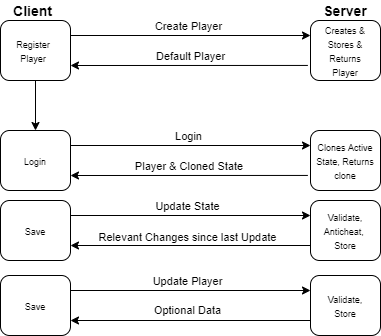

# WebAssemblyGameTemplate
## What is this?
This template makes it easy to create Browser Games using Blazor WebAssembly and Javascript.
It comes with everything required to start building your Game:
## Features
- Remote Save Storage (Using a Rest API in the Backend)
- EFCore Database Connection
  - Premade DBContext and models you can just add to
- Server Side Anti Cheat Support
  - Different Save States per Tab (individually stored) to make checking Save Updates easier
- Protection against people trying to send requests manually
  - Secret algorithm that is required to send State Updates
  - Decompilation is required to extract the algorithm

## How to use
1. Clone the Repository
2. Set the Assembly Name of your Client Project in the WebAssemblyHook.js file
3. Implement some sort of Loading / Creating of SaveStates on the Client 
4. Start Adding your game logic

## Save System

**Important:** 
The States and Players are created Server Side!
Client Side creating is not possible because you cannot check inital values because you cannot tell how old they are.